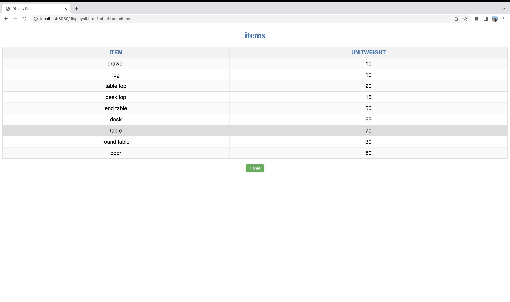

# Bonus Project

## Background

- This is a software project written in Java using the Spring Boot framework. It allows users to interact with a pre-defined list of tables and views and execute Create, Read, Update, and Delete (CRUD) queries.
- The project uses H2, an in-memory database, to store and retrieve data. H2 is a lightweight and fast database management system that is popular for testing and prototyping purposes.
- When the application starts, it executes two files: **`Schema.sql`** and **`Data.sql`**. **`Schema.sql`** defines the structure of the database, including the tables and views, while **`Data.sql`** inserts data into the tables.
- The **`ApiController.java`** file handles requests from users to display data from a specific table or view. It searches the database and returns the result as a JSON object.
- The **`UpdateTableController.java`** file handles user-submitted queries and updates the database accordingly. It also displays the result of the query, whether it was successful or not, in the **`result.html`** file.
- The **`index.html`** file is the main page of the project. It provides links to the **`displayall.html`** and **`update.html`** pages.
- The **`displayall.html`** page displays the content of a table or view as a table. Users can select a table or view from a drop-down list and click the **`Submit`** button to view its content.
- The **`update.html`** page allows users to submit a custom query to update the database. Users can enter their query in the text box and click the **`Execute`** button to run it. The **`result.html`** page then displays the result of the query.
- Overall, this project provides a simple and user-friendly interface for interacting with a database using Java and the Spring Boot framework.

## Working

- Upon successful startup of the application, the homepage can be accessed by visiting the URL '**[http://localhost:8080/](http://localhost:8080/)**'. The homepage comprises a menu that offers the option to view the contents of a pre-defined table or submit a query to be executed on the database.

- To view the contents of a table, select the table from the dropdown list, and click the 'Submit' button. The table or view's contents are presented in a tabular format.

To return to the homepage, click the 'Home' button.

- Selecting the 'Update Tables' button redirects you to a page where you can submit a query to be executed on the database. After entering your query, click on the 'Execute' button to run the query on the database.
- Example:
1. Initial ‘Items’ table

b. Running insert query

c. For instance, if you insert data into the 'Items' table using a query, you can view the added data by accessing the 'Items' table. This can also be achieved by directly visiting the URL **[http://localhost:8080/displayall.html?tableName=items](http://localhost:8080/displayall.html?tableName=items)**).

Here record ‘door’ was inserted.

d. Submitting an incorrect query results in an error message indicating the issue with the query.

